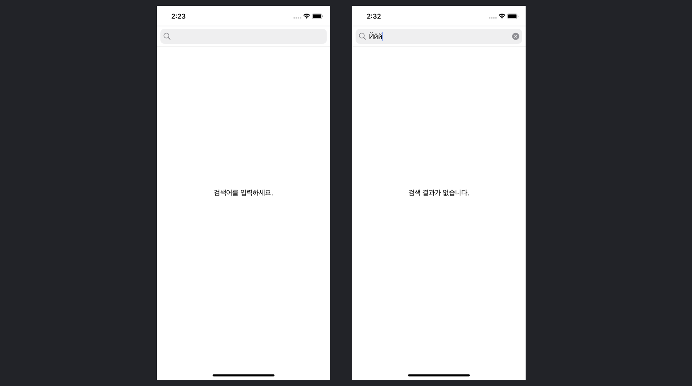
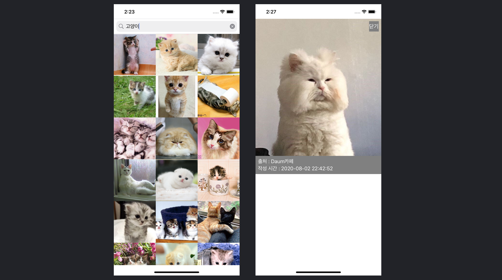
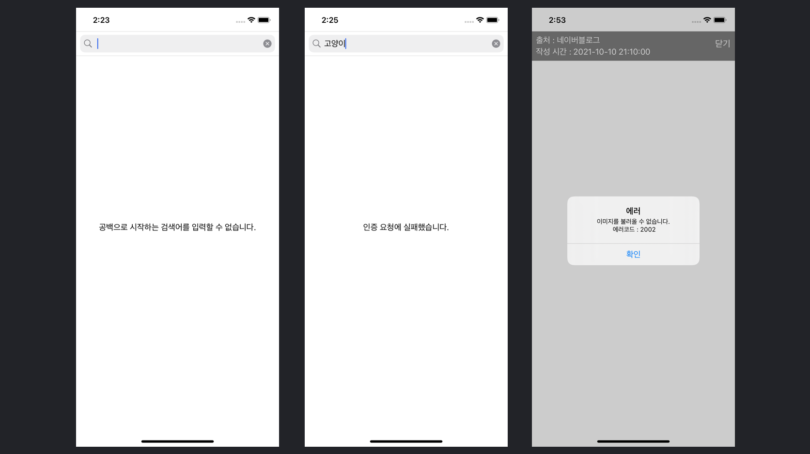

# 이미지 검색

다음 이미지 검색 API 를 활용한 이미지 검색 앱

## 개발 환경
- Xcode 13.1, Swift 5.5, iOS 15.0
- Daum 이미지 검색 API (https://developers.kakao.com/docs/latest/ko/daum-search/dev-guide#search-image)

## 구현체
- 검색화면 (SearchViewController, SearchViewModel, ImageCell)
- 상세화면 (ImageDetailViewController, ImageDetailViewModel)
- 네트워크 통신 (SearchAPIService)
- 데이터 모델 (ImageItem, SearchResult)
- 유틸 (String+Util, Error+Search)

## 사용 기술 
- MVVM
- RxSwift, RxCocoa (https://github.com/ReactiveX/RxSwift)
- Alamofire (https://github.com/Alamofire/Alamofire)
- Kingfisher (https://github.com/onevcat/Kingfisher)
- Snapkit (https://github.com/SnapKit/SnapKit)

## 앱 동작 화면, 주요 기능

#### 실행화면
#### 검색 결과가 없을때 - 문자열 표시

#### 검색 결과 - 텍스트 추가시 1초마다 API 호출, 기본 30개 이미지 로드, 페이징 처리 
#### 이미지 상세 - 전체화면, 출처/작성시간 표시, 이미지가 화면 크기보다 길 경우 스크롤
 

#### 에러 처리 - 검색어 첫 글자 공백 시, http status code, 상세 이미지 로드

